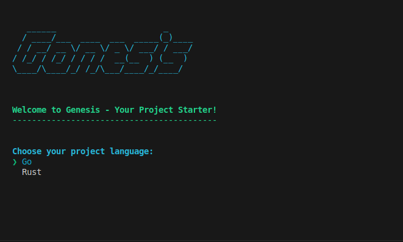

<h2 align="center">Genesis 🌱</h1>
<h3 align="center">Genesis is a powerful, flexible, and user-friendly project starter tool designed for Go and Rust developers. It streamlines the initial setup process, allowing developers to focus on what truly matters: building great applications and solving business problems.</h3>

<p align="center">
    
</p>

## 🌟 Features

- **Quick Setup**: Rapidly initialize Go and Rust projects with best practices in them
- **Interactive CLI**: User-friendly command-line interface for easy project configuration
- **Language Selection**: Support for Go and Rust, with room for expansion
- **Customizable Paths**: Flexibly set project locations
- **Curated Templates**: Clone from carefully crafted starter repositories
- **Automatic Dependency Management**: Run `go mod tidy` for Go and `cargo build` for Rust projects
- **Cross-Platform**: Works seamlessly on Windows, macOS, and Linux
- **Progress Visualization**: Clear progress bars for long-running operations

## 🚀 Why Genesis?

When developing software, setting up a new project can be a time-consuming and often frustrating process. Genesis solves this problem by:

1. **Eliminating Boilerplate**: No more time wasted on repetitive setup tasks
2. **Enforcing Best Practices**: Start with a solid foundation based on community standards
3. **Reducing Decision Fatigue**: Curated project structures let you focus on your unique ideas
4. **Accelerating Development**: Get to writing meaningful code faster
5. **Ensuring Consistency**: Maintain uniformity across multiple projects

By handling the initial setup, Genesis allows developers to immediately dive into application core functionality and business logic, significantly reducing time-to-market for new ideas.

## 🛠 Installation

Install Genesis using Cargo, the Rust package manager:

```bash
cargo install genesis
```

## 📘 Usage

Genesis offers both interactive and non-interactive modes to suit your workflow:

### Interactive Mode

Simply run:

```bash
genesis run
```

Follow the prompts to select your project language and specify the project name.

### Non-Interactive Mode

Specify the language and path directly:

```bash
genesis run --language <LANG> --path /path/to/your/project
```

For example:
```bash
genesis run --language rust --path /path/to/your/project
```

### Available Commands

- `genesis`: Display version and available commands
- `genesis run`: Start the interactive project setup
- `genesis run --language <LANG> --path <PATH>`: Run with specific language and path
- `genesis --help`: Show the help message with all available options

<!-- ## 🏗 Project Templates

Genesis uses the following starter templates:

- Go: [go-project-starter](https://github.com/ThembinkosiThemba/go-project-starter.git)
- Rust: [rust-project-starter](https://github.com/ThembinkosiThemba/rust-project-starter.git)

These templates are carefully made to provide a solid starting point for your projects, incorporating best practices and common dependencies. -->

## 🤝 Contributing

We welcome contributions to Genesis! Whether it's adding new features, improving documentation, or reporting bugs, your help is appreciated. Please feel free to:

1. Submit issues
2. Fork the repository
3. Send pull requests

Check out our [Contributing Guidelines](CONTRIBUTING.md) for more details.

## 📄 License

This project is licensed under the MIT License - see the [LICENSE](LICENSE) file for details.

<!-- ## 🙏 Acknowledgments

- Thanks to all contributors who have helped shape Genesis
- Inspired by various project starter tools in the Go and Rust ecosystems -->

## 📞 Contact

If you have any questions or need support, feel free to:

- Open an issue on GitHub
- Reach out to the maintainer: [Thembinkosi Mkhonta](https://github.com/ThembinkosiThemba)
