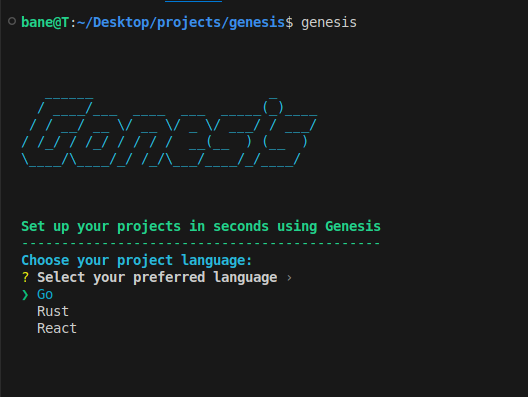

<h2 align="start">Genesis 🌱</h1>
<h3 align="start">Genesis is a simple, flexible, and user-friendly project starter tool designed for developers. It streamlines the initial setup process, simpifying it and getting rid of a lot of mundaine setup processes</h3>

<p align="start">
    
</p>

## Get Started

```sh
cargo install genesis_rs
genesis -h
```

## Why Genesis?

When developing software, setting up a new project can be a time-consuming and oftenly a frustrating process. Genesis solves this problem by:

- **Quick Setup and Interactive CLI**: Quickly initialize Go and Rust projects using your CLI for easy project configuration
- **Language Support**: Support for Go, Rust and React(typescript)
- **Customizable Paths**: Flexibly set project locations
- **Automatic Dependency Management**: Automatically installs dependancies using the different package managers
- **Cross-Platform**: Works on Windows, macOS, and Linux-based systems

## Installation

Install Genesis using Cargo, the Rust package manager:

```bash
cargo install genesis_rs
```

## 📘 Usage

Genesis offers both interactive and non-interactive modes to suit your workflow:

### Interactive Mode

Simply run:

```bash
genesis run
```

Or

```bash
genesis
```

Follow the prompts to select your project language and specify the project name.

### Available Commands

- `genesis`: Display version and available commands
- `genesis run`: Start the interactive project setup
- `genesis update` : Update genesis to the latest version
- `genesis --help`: Show the help message with all available options

## 🤝 Contributing

We welcome contributions to Genesis! Whether it's adding new features, improving documentation, or reporting bugs, your help is appreciated. Please feel free to:

1. Submit issues
2. Fork the repository
3. Send pull requests

## 📄 License

This project is licensed under the MIT License - see the [LICENSE](LICENSE) file for details.

## 📞 Contact

If you have any questions or need support, feel free to:

- Open an issue on GitHub
- Reach out to the maintainer: [Thembinkosi Mkhonta](https://github.com/ThembinkosiThemba)
